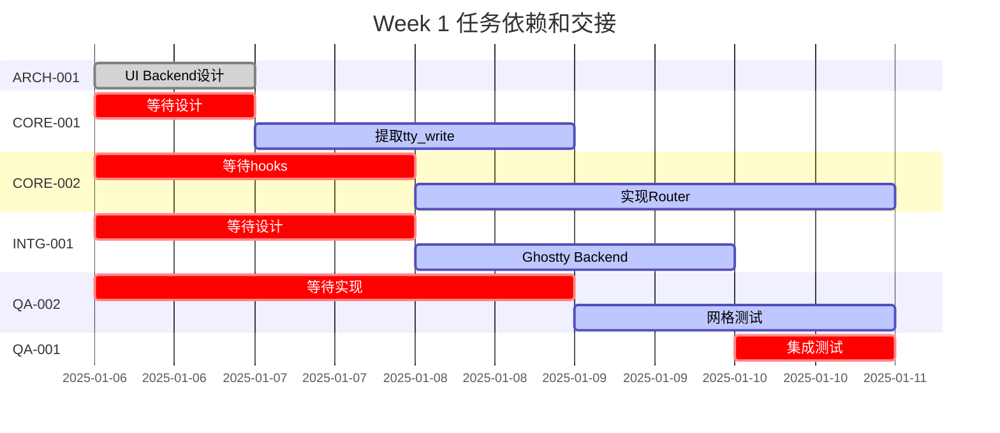

# 第一周协作计划 - Week 1 Coordination Plan
## 交接点和依赖管理

### 关键交接时间表 (Critical Handoff Schedule)



### 每日交接点 (Daily Handoff Points)

#### 周一 (2025-01-06)
| 时间 | 交接内容 | 从 | 到 | 文件/产物 |
|------|---------|----|----|-----------|
| 14:00 | UI Backend 设计评审 | ARCH-001 | CORE-001, INTG-001 | ui_backend.h |
| 15:00 | 设计确认 | ARCH-001 | CORE-002 | backend_vtable_spec.md |
| 16:00 | 构建系统就绪 | OPS-001 | ALL | Makefile |

#### 周二 (2025-01-07)
| 时间 | 交接内容 | 从 | 到 | 文件/产物 |
|------|---------|----|----|-----------|
| 10:00 | 进展同步 | CORE-001 | CORE-002 | 初步 hooks 列表 |
| 15:00 | Hooks 实现 | CORE-001 | CORE-002 | tty_write_hooks.c |
| 16:00 | 测试框架 | QA-001 | QA-002 | test_framework/ |

#### 周三 (2025-01-08)
| 时间 | 交接内容 | 从 | 到 | 文件/产物 |
|------|---------|----|----|-----------|
| 11:00 | Router 初版 | CORE-002 | INTG-001 | backend_router.c (draft) |
| 14:00 | 集成点讨论 | CORE-002 | INTG-001 | 接口对齐 |
| 16:00 | 测试用例 | QA-001 | CORE-002, INTG-001 | test_cases.yaml |

#### 周四 (2025-01-09)
| 时间 | 交接内容 | 从 | 到 | 文件/产物 |
|------|---------|----|----|-----------|
| 10:00 | Router 完成 | CORE-002 | QA-002 | backend_router.c |
| 11:00 | Backend 完成 | INTG-001 | QA-002 | backend_ghostty.c |
| 14:00 | 集成测试准备 | QA-002 | QA-001 | 单元测试结果 |
| 16:00 | 构建验证 | OPS-001 | QA-001 | 所有组件可构建 |

#### 周五 (2025-01-10)
| 时间 | 交接内容 | 从 | 到 | 文件/产物 |
|------|---------|----|----|-----------|
| 10:00 | 测试执行 | QA-002 | QA-001 | test_grid_ops 结果 |
| 14:00 | 集成测试结果 | QA-001 | ALL | integration_report.md |
| 16:00 | Go/No-Go 决策 | QA-001 | PM | 周一验收报告 |
| 17:00 | 周总结 | ALL | PM | 各自的状态报告 |

### 沟通协议 (Communication Protocol)

#### 1. 每日站会 (Daily Standup)
- **时间**: 每天 9:00 AM
- **时长**: 15分钟
- **格式**: 
  ```
  昨天完成：[具体成果]
  今天计划：[具体任务]
  阻塞问题：[需要帮助]
  交接需求：[给谁什么]
  ```

#### 2. 阻塞升级 (Blocker Escalation)
```
发现阻塞 → 10分钟内尝试解决 → 升级到相关方 → 30分钟内升级到PM
```

#### 3. 代码提交规范 (Commit Convention)
```bash
# 提交格式
git commit -m "[TASK-ID] Component: Brief description

- Detailed change 1
- Detailed change 2

Tested: [Yes/No]
Review: [Reviewer]"

# 示例
git commit -m "[T-101] tty: Extract tty_write hooks

- Added ui_backend interface
- Implemented 35 hook functions
- Maintained backward compatibility

Tested: Yes (unit tests pass)
Review: ARCH-001"
```

#### 4. 文件交接标准 (File Handoff Standard)
每个交接的文件必须包含：
- 文件头注释说明用途
- 接口文档（如果是头文件）
- 简单的使用示例
- 已知限制或TODO

```c
/**
 * ui_backend.h - UI Backend Interface for libtmuxcore
 * 
 * Author: ARCH-001
 * Date: 2025-01-06
 * Version: 1.0
 * 
 * This file defines the abstract interface for UI backends.
 * 
 * Usage:
 *   struct ui_backend *backend = get_ghostty_backend();
 *   backend->draw_cells(spans, count);
 * 
 * TODO: Add batch optimization in v1.1
 */
```

### 风险监控 (Risk Monitoring)

| 风险点 | 监控指标 | 触发条件 | 缓解措施 |
|--------|---------|---------|----------|
| 设计延迟 | ARCH-001 交付时间 | >14:00 周一 | CORE-001 准备备选方案 |
| Hooks 不完整 | 函数覆盖率 | <90% | CORE-002 协助识别 |
| Router 性能 | 开销测试 | >2% | INTG-003 介入优化 |
| 测试阻塞 | 测试执行率 | <80% | 增加 QA 资源 |
| 集成失败 | 集成测试通过率 | <95% | 周末加班修复 |

### 质量检查点 (Quality Checkpoints)

#### 周三检查点
- [ ] UI Backend 设计已实现
- [ ] tty_write hooks 已提取
- [ ] Router 框架完成
- [ ] 构建系统正常

#### 周四检查点  
- [ ] Router 功能完整
- [ ] Ghostty backend 完成
- [ ] 单元测试 >50% 完成
- [ ] 无阻塞性问题

#### 周五检查点
- [ ] 所有代码已提交
- [ ] 测试覆盖 >65%
- [ ] 集成测试通过
- [ ] 文档已更新

### 周五验收标准 (Friday Acceptance Criteria)

必须完成 (P0)：
- ✅ ui_backend.h 定义完整
- ✅ tty_write hooks 已实现
- ✅ Backend router 工作正常
- ✅ 基础测试通过

应该完成 (P1)：
- ✅ Ghostty backend stub 完成
- ✅ 性能基准建立
- ✅ 文档更新

可以延期 (P2)：
- ⏸ 完整的 Ghostty 集成
- ⏸ 100% 测试覆盖
- ⏸ 性能优化

### 成功标准 (Success Metrics)
- 代码行数：~2000 行新代码
- 测试用例：50+ 个
- 缺陷密度：<5 bugs/KLOC
- 进度偏差：<10%