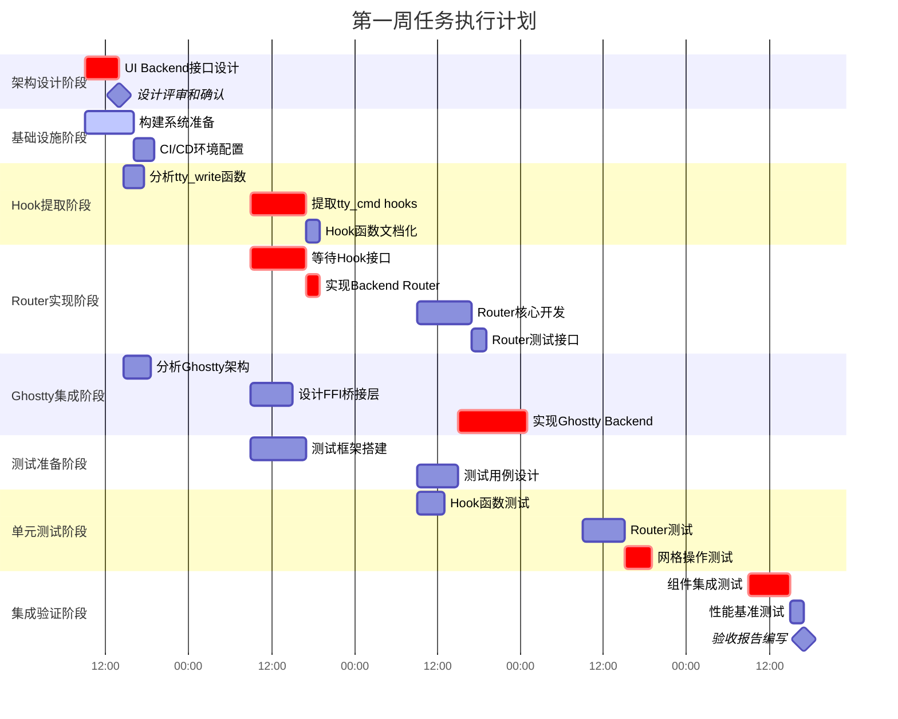
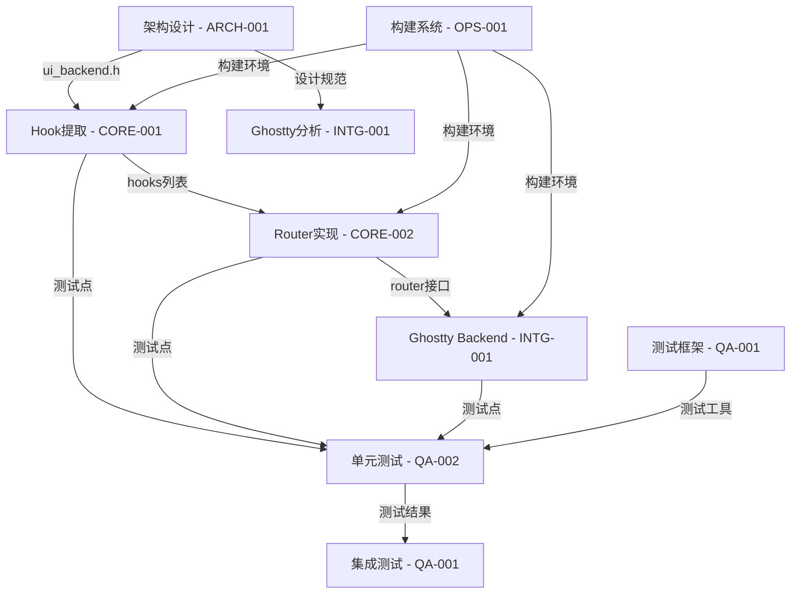

# Ghostty × tmux 集成项目 - 项目经理任务分配规划书

## 一、项目概述

### 项目目标
将 tmux 核心以内嵌库 libtmuxcore 的形式嵌入 Ghostty，实现结构化网格与事件回调驱动的渲染与输入。

### 项目路径
```
/Users/jqwang/98-ghosttyAI/
├── tmux/                    # tmux 源代码（C语言）
├── ghostty/                 # Ghostty 源代码（Zig语言）
├── cache/week1/             # 各团队工作目录
├── docs/                    # 项目文档
└── 01-施工流程/             # 施工计划文档
```

### 当前团队布局（my-project session）
```
窗口0: tmux-project-manager      # 项目经理（您）
窗口1: ghostty-tmux-architect    # 系统架构师
窗口2: devops-build-engineer     # DevOps工程师
窗口3: CORE-001-C高级开发        # C语言高级开发
窗口4: CORE-002-C开发            # C语言开发
窗口5: INTG-001-Zig高级开发      # Zig高级开发
窗口6: QA-001-测试主管           # 测试主管
窗口7: QA-002-测试工程师         # 测试工程师
```

## 二、第一周任务分配甘特图



## 三、详细施工流程

### 第一步：架构设计启动（周一 09:00-14:00）

#### 任务分配
**发送给**: ghostty-tmux-architect (窗口1)
**执行角色**: system-architect（系统架构师）
```bash
任务：设计 UI Backend 抽象接口
角色：请以 system-architect 系统架构师的角色执行
输入：project_spec.md, tmux/tty.c 源码分析
期望输出：
1. ui_backend.h 头文件设计
2. backend_vtable 结构定义
3. 回调函数签名规范
交付时间：14:00
交付位置：cache/week1/ARCH-001/ui_backend.h
```

#### 并行任务
**发送给**: devops-build-engineer (窗口2)
**执行角色**: devops-engineer-ops001（DevOps工程师）
```bash
任务：准备构建系统
角色：请以 devops-engineer-ops001 DevOps工程师的角色执行
输入：项目结构，编译需求
期望输出：
1. Makefile 支持 libtmuxcore 构建
2. 测试框架集成
3. CI/CD 配置文件
交付时间：16:00
交付位置：cache/week1/OPS-001/build/
```

### 第二步：Hook 提取阶段（周一 14:30 - 周二 17:00）

#### 任务分配
**发送给**: CORE-001-C高级开发 (窗口3)
**执行角色**: c-tmux-specialist（C语言tmux专家）
```bash
任务：提取 tty_write 相关 hooks
角色：请以 c-tmux-specialist C语言tmux专家的角色执行
前置条件：收到 ui_backend.h 设计
输入：
- cache/week1/ARCH-001/ui_backend.h
- tmux/tty.c 源码
期望输出：
1. 所有 tty_cmd_* 函数的 hook 实现（约22个）
2. tty_write_hooks.c 实现文件
3. 函数映射表
交付时间：周二 17:00
交付位置：cache/week1/CORE-001/tty_write_hooks.c
```

### 第三步：Router 开发阶段（周二 17:00 - 周四 11:00）

#### 任务分配
**发送给**: CORE-002-C开发 (窗口4)
**执行角色**: libtmux-core-developer（libtmux核心开发者）
```bash
任务：实现 Backend Router
角色：请以 libtmux-core-developer libtmux核心开发者的角色执行
前置条件：收到 hooks 实现
输入：
- cache/week1/CORE-001/tty_write_hooks.c
- cache/week1/ARCH-001/ui_backend.h
期望输出：
1. backend_router.c - 路由实现
2. 支持传统 TTY 和新 UI backend 切换
3. 线程安全保证
交付时间：周四 11:00
交付位置：cache/week1/CORE-002/backend_router.c
```

### 第四步：Ghostty 集成阶段（周三 15:00 - 周四 14:00）

#### 任务分配
**发送给**: INTG-001-Zig高级开发 (窗口5)
**执行角色**: zig-ghostty-integration（Zig集成专家）
```bash
任务：实现 Ghostty Backend
角色：请以 zig-ghostty-integration Zig集成专家的角色执行
前置条件：Router 接口确定
输入：
- cache/week1/CORE-002/backend_router.c（接口部分）
- cache/week1/CORE-001/tty_write_hooks.h
- cache/week1/ARCH-001/ui_backend.h
- ghostty/src/ 源码分析
期望输出：
1. backend_ghostty.c - Ghostty 后端实现
2. ghostty_ffi_bridge.zig - FFI 桥接层（Zig 部分）
3. 回调注册机制
交付时间：周四 14:00
交付位置：cache/week1/INTG-001/backend_ghostty.c
```

### 第五步：测试验证阶段（周三 09:00 - 周五 14:00）

#### 阶段一：测试准备
**发送给**: QA-001-测试主管 (窗口6)
**执行角色**: qa-test-lead（测试主管）
```bash
任务：搭建测试框架和策略
角色：请以 qa-test-lead 测试主管的角色执行
输入：所有技术设计文档
期望输出：
1. 测试框架配置（Makefile.test）
2. 测试用例清单（test_cases.yaml）
3. 覆盖率目标设定（>65%）
交付时间：周三 15:00
交付位置：cache/week1/QA-001/test_framework/
```

#### 阶段二：单元测试
**发送给**: QA-002-测试工程师 (窗口7)
**执行角色**: qa-test-engineer（测试工程师）
```bash
任务：执行单元测试
角色：请以 qa-test-engineer 测试工程师的角色执行
前置条件：收到各组件实现
输入：
- cache/week1/CORE-001/tty_write_hooks.c
- cache/week1/CORE-002/backend_router.c
- cache/week1/INTG-001/backend_ghostty.c
期望输出：
1. test_grid_ops 测试结果
2. 单元测试报告
3. 覆盖率报告（目标>65%）
交付时间：周五 10:00
交付位置：cache/week1/QA-002/test_results/
```

#### 阶段三：集成测试
**发送给**: QA-001-测试主管 (窗口6)
**执行角色**: qa-test-lead（测试主管）
```bash
任务：执行集成测试
角色：请以 qa-test-lead 测试主管的角色执行
前置条件：单元测试通过
输入：所有组件和单元测试结果
期望输出：
1. 集成测试报告
2. 性能基准数据
3. Go/No-Go 建议
交付时间：周五 14:00
交付位置：cache/week1/QA-001/integration_report.md
```

## 四、依赖关系和关键路径

### 关键路径（必须按序完成）
```
架构设计(5h) → Hook提取(11h) → Router实现(13h) → 集成测试(6h) = 35小时
```

### 依赖关系图


## 五、风险管理和应急预案

### 高风险点监控

| 风险项 | 触发条件 | 应急措施 | 责任人 |
|--------|----------|----------|--------|
| 架构设计延迟 | 14:00前未交付 | 启用备选简化设计 | CORE-001自行决策 |
| Hook提取不完整 | 覆盖率<90% | CORE-002协助识别遗漏 | 项目经理协调 |
| Router性能问题 | 开销>2% | 降级到直接调用模式 | INTG-001优化 |
| 测试阻塞 | 执行率<80% | 增加测试资源/降低覆盖要求 | QA-001决策 |
| 集成失败 | 通过率<95% | 延期至周末修复 | 全员参与 |

### 每日检查点

#### 周一 17:00
- [ ] 架构设计完成并通过评审
- [ ] 构建系统基础版本就绪
- [ ] CORE-001 开始 hook 分析

#### 周二 17:00
- [ ] Hook 提取完成
- [ ] 测试框架搭建完成
- [ ] CORE-002 开始 Router 开发

#### 周三 17:00
- [ ] Router 框架完成50%
- [ ] Ghostty Backend 设计完成
- [ ] 测试用例编写开始

#### 周四 17:00
- [ ] Router 完成并提交
- [ ] Ghostty Backend 完成
- [ ] 单元测试执行50%

#### 周五 14:00
- [ ] 所有单元测试通过
- [ ] 集成测试完成
- [ ] 验收报告就绪

## 六、沟通协调机制

### 每日站会（09:00）
```bash
# 项目经理在 window 0 收集状态
for window in 1 2 3 4 5 6 7; do
  tmux send-keys -t my-project:$window "
  STATUS $(date +%Y-%m-%d):
  完成: [具体成果]
  今日: [计划任务]
  阻塞: [需要帮助]
  交接: [产物/时间]
  " Enter
done
```

### 实时监控脚本
```bash
#!/bin/bash
# 项目经理监控脚本
while true; do
  clear
  echo "=== 项目状态监控 $(date) ==="
  for window in 1 2 3 4 5 6 7; do
    echo "--- Window $window ---"
    tmux capture-pane -t my-project:$window -p | tail -5
  done
  sleep 300  # 每5分钟刷新
done
```

### 阻塞升级流程
1. 发现阻塞 → 10分钟内自行尝试
2. 无法解决 → 通知相关方
3. 30分钟无响应 → 升级到项目经理
4. 项目经理介入协调资源

## 七、交付物清单

### 必须交付（P0）
- [x] ui_backend.h - 接口定义
- [x] tty_write_hooks.c - Hook实现
- [x] backend_router.c - 路由器
- [x] 基础测试通过率 >90%

### 应该交付（P1）
- [x] backend_ghostty.c - Ghostty后端
- [x] 性能基准数据
- [x] 完整文档更新

### 可选交付（P2）
- [ ] 完整Ghostty集成
- [ ] 100%测试覆盖
- [ ] 性能优化完成

## 八、成功标准

### 量化指标
- 代码交付：~2000行新代码
- 测试用例：50+ 个
- 测试覆盖：>65%
- 缺陷密度：<5 bugs/KLOC
- 进度偏差：<10%

### 质量标准
- 所有P0任务完成
- 无阻塞性缺陷
- 文档完整可追溯
- 代码通过review

## 九、项目经理行动清单

### 周一
- [ ] 09:00 - 部署架构设计任务
- [ ] 09:30 - 部署构建系统任务
- [ ] 14:00 - 验收架构设计
- [ ] 14:30 - 部署Hook提取任务
- [ ] 17:00 - 日终状态检查

### 周二
- [ ] 09:00 - 晨会协调
- [ ] 11:00 - Hook进度检查
- [ ] 15:00 - 验收Hook实现
- [ ] 17:00 - 部署Router任务

### 周三
- [ ] 09:00 - 测试准备检查
- [ ] 11:00 - Router进度确认
- [ ] 14:00 - 集成点协调
- [ ] 17:00 - 中期检查点

### 周四
- [ ] 09:00 - 集成准备
- [ ] 11:00 - Router验收
- [ ] 14:00 - Backend验收
- [ ] 17:00 - 测试执行确认

### 周五
- [ ] 09:00 - 测试结果收集
- [ ] 11:00 - 问题处理
- [ ] 14:00 - 集成测试验收
- [ ] 16:00 - 周总结报告
- [ ] 17:00 - 下周计划

---

## 十、角色分配总览

| 窗口 | 任务代码 | 执行角色 | 专业领域 | 主要职责 |
|------|----------|----------|----------|----------|
| 1 | ARCH-001 | system-architect | 系统架构设计 | UI Backend接口设计、架构评审 |
| 2 | OPS-001 | devops-engineer-ops001 | DevOps工程 | 构建系统、CI/CD、部署 |
| 3 | CORE-001 | c-tmux-specialist | C/tmux开发 | Hook提取、tmux内部机制 |
| 4 | CORE-002 | libtmux-core-developer | C库开发 | Router实现、库封装 |
| 5 | INTG-001 | zig-ghostty-integration | Zig/FFI | Ghostty集成、FFI桥接 |
| 6 | QA-001 | qa-test-lead | 测试管理 | 测试策略、框架、集成测试 |
| 7 | QA-002 | qa-test-engineer | 测试执行 | 单元测试、覆盖率分析 |

## 十一、任务分配模板

### 标准任务分配格式
```bash
任务：[任务名称]
角色：请以 [agent-type] [中文角色名]的角色执行
前置条件：[依赖项]
输入：
- [输入文件1]
- [输入文件2]
期望输出：
1. [输出1]
2. [输出2]
交付时间：[时间]
交付位置：[路径]
```

---

**文档版本**: v2.0
**创建时间**: 2025-01-06
**最后更新**: 2025-08-25
**负责人**: 项目经理