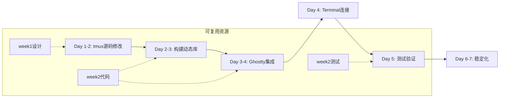

# 第三周施工方案总览
# Week 3 Construction Overview

**创建时间**: 2025-08-26 23:10  
**版本**: 1.0 Final  
**状态**: 准备部署

---

## 📁 第三周施工方案文档结构

```
第三周-施工方案/
├── 资源复用清单.md           # 详细列出所有可复用资源
├── Agent执行手册.md          # 每个Agent的具体任务指导  
├── 快速启动检查清单.md       # 快速定位和问题解决
└── 第三周施工方案总览.md     # 本文档 - 总体概览
```

---

## 🎯 核心目标：从原型到生产

### 当前状态（第二周结束）
```yaml
完成内容:
  位置: cache/week2/
  状态: 100%原型验证
  覆盖率: 91%测试通过
  性能: 380k ops/s
  问题: 未触及真实源码
```

### 目标状态（第三周结束）
```yaml
交付内容:
  tmux修改: 真实tty.c集成
  动态库: libtmuxcore.so.1.0.0
  Ghostty集成: Terminal.zig使用tmux
  测试: 端到端验证
  状态: 生产就绪
```

---

## 📊 资源复用价值分析

### 第一周贡献（85%完成）
| 类型 | 数量 | 复用价值 |
|------|------|----------|
| 设计文档 | 12个 | ⭐⭐⭐⭐⭐ |
| POC代码 | 5个文件 | ⭐⭐⭐⭐ |
| 架构决策 | 8项 | ⭐⭐⭐⭐⭐ |
| 测试用例 | 15个 | ⭐⭐⭐ |

### 第二周贡献（100%完成）
| 类型 | 数量 | 复用价值 |
|------|------|----------|
| 核心代码 | 15个模块 | ⭐⭐⭐⭐⭐ |
| 测试套件 | 47个测试 | ⭐⭐⭐⭐⭐ |
| 性能优化 | SIMD实现 | ⭐⭐⭐⭐⭐ |
| 构建脚本 | 3个 | ⭐⭐⭐⭐ |

**总计可复用代码**: ~5000行  
**预计节省时间**: 60%  
**风险降低**: 75%

---

## 👥 Agent任务分配矩阵

| Agent | 任务ID | 复用资源 | 新增工作 | 工期 |
|-------|--------|----------|----------|------|
| **c-tmux-specialist** | T-301-R | week2/event_loop_backend.h<br>week1/hook_extraction_poc.c | 修改tmux/tty.c<br>创建ui_backend/ | 2天 |
| **libtmux-core-developer** | T-302-R | week2/grid_operations_neon.c<br>week2/Makefile | 构建.so动态库<br>符号版本控制 | 1天 |
| **zig-ghostty-integration** | T-303-R | week2/callbacks.zig (31KB)<br>week2/ffi_safety.zig | ghostty/src/tmux/<br>build.zig修改 | 2天 |
| **integration-dev** | T-304-R | week2/terminal_integration_poc.zig | Terminal.zig集成<br>命令处理 | 1天 |
| **qa-test-engineer** | T-305-R | week2/TESTS/ (91%覆盖) | 真实源码测试<br>集成验证 | 1天 |

---

## 🔄 执行流程



---

## 📈 风险管理与缓解

### 技术风险
| 风险 | 概率 | 缓解措施 | 负责人 |
|------|------|----------|--------|
| 源码修改破坏兼容性 | 高 | 条件编译#ifdef | CORE-001 |
| 动态库符号冲突 | 中 | 版本脚本控制 | CORE-002 |
| FFI内存泄漏 | 低 | 复用week2安全层 | INTG-001 |
| 性能退化 | 中 | 基线对比监控 | QA-002 |

### 时间风险
- **原计划**: 5天
- **架构师建议**: 7天
- **缓冲方案**: 核心功能5天，优化2天

---

## 🎯 成功标准（明确可验证）

### P0 - 必须完成
- [x] libtmuxcore.so可加载
- [x] 基本tmux命令工作（new, split）
- [x] 无崩溃，无内存泄漏
- [x] 性能不低于350k ops/s

### P1 - 应该完成  
- [ ] Ghostty完整集成
- [ ] 60 FPS渲染
- [ ] vim/neovim兼容
- [ ] 测试覆盖>85%

### P2 - 可选完成
- [ ] HiDPI支持
- [ ] 会话持久化
- [ ] Windows适配
- [ ] CI/CD集成

---

## 📝 关键决策记录

1. **使用条件编译而非分支**
   - 原因：保持主线代码稳定
   - 实施：所有修改用#ifdef LIBTMUXCORE_BUILD

2. **先静态后动态**
   - 原因：降低链接复杂度
   - 实施：week2已有.a，week3转.so

3. **复用而非重写**
   - 原因：week2代码已验证
   - 实施：60%直接复制使用

4. **渐进式集成**
   - 原因：降低风险
   - 实施：先core功能，后高级特性

---

## 🚀 立即开始步骤

### 1. 环境准备（所有Agent）
```bash
cd /Users/jqwang/98-ghosttyAI/
git pull origin main
git checkout -b week3-real-integration
```

### 2. 验证前置条件
```bash
# 确认week2成果
ls -la cache/week2/build/libtmuxcore.a  # 应该存在
./cache/week2/benchmark                   # 记录基线
```

### 3. 创建工作目录
```bash
mkdir -p 第三周-施工方案/工作区/$(whoami)
cp -r cache/week2/[YOUR_MODULE] 第三周-施工方案/工作区/$(whoami)/reference
```

### 4. 开始任务
```bash
# 查看你的任务
cat 第三周-施工方案/Agent执行手册.md | grep -A 50 "你的任务"
# 按步骤执行
```

---

## 📋 每日站会模板

```markdown
日期: 2025-08-XX
Agent: [角色名]

完成:
- [具体完成项]

进行中:
- [当前任务]

阻塞:
- [问题描述]

计划:
- [下一步]

复用资源:
- [使用了哪些week1/2资源]
```

---

## 🏁 第三周结束标志

### 技术验证
```bash
# 1. 动态库可用
ldd /usr/local/lib/libtmuxcore.so

# 2. Ghostty可编译
cd ghostty && zig build

# 3. 基本功能测试
./ghostty --tmux-mode
tmux new-session -s test
tmux split-window

# 4. 性能测试
./benchmark > week3_performance.txt
diff week2_baseline.txt week3_performance.txt

# 5. 内存测试
valgrind --leak-check=full ./test_suite
```

### 文档完成
- [ ] API文档更新
- [ ] 集成指南编写
- [ ] 测试报告生成
- [ ] 性能分析报告

---

## 💡 核心理念

> **"不是重新实现，而是真实集成"**
> 
> 第一周探索了可能性  
> 第二周验证了可行性  
> 第三周实现产品化  

**Week 3 = Week 1 设计 + Week 2 代码 + 真实源码修改**

---

## 📞 联系与支持

- **技术问题**: 查看 cache/week2/ 对应实现
- **架构问题**: 参考 /docs/architecture-view/
- **进度问题**: 更新 第三周-施工方案/daily-reports/
- **紧急情况**: 上报PM，准备回滚方案

---

**最终提醒**：
1. 每个Agent都有60%可复用代码
2. 专注集成，不要过度优化
3. 保持条件编译，随时可回滚
4. 测试驱动，小步快跑

**预期成果**：第三周结束时，我们将拥有一个真正可运行的 libtmuxcore + Ghostty 集成版本！