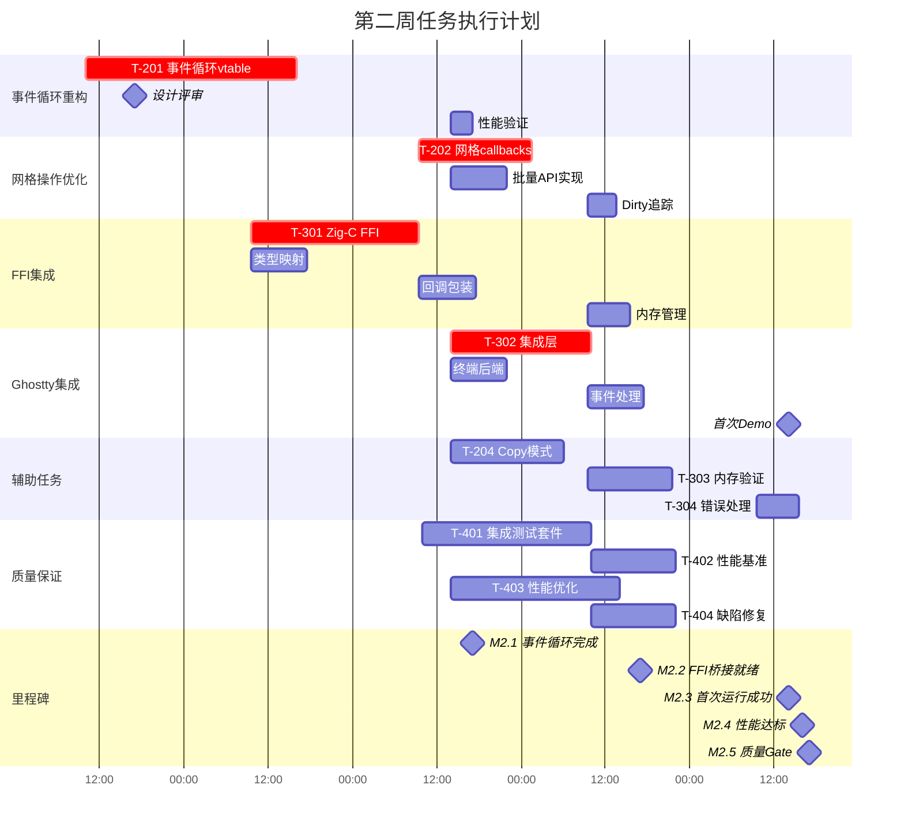
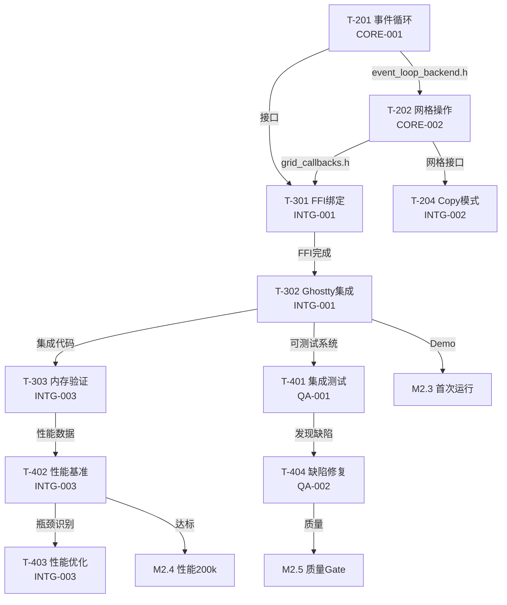

# Ghostty × tmux 集成项目 - 第二周项目经理任务分配规划书

## 一、项目概述

### 第二周战略目标
基于第一周完成的UI Backend基础架构（100%完成），深入实现事件循环集成和网格操作优化，让tmux真正运行在Ghostty内部。

### 项目路径
```
/Users/jqwang/98-ghosttyAI/
├── tmux/                    # tmux 源代码（分析用）
├── ghostty/                 # Ghostty 源代码（分析用）
├── cache/week2/             # 第二周各团队工作目录
├── docs/任务清单/第二周/    # 第二周任务文档
└── 第二周-施工流程/         # 第二周施工计划
```

### 当前团队布局（tmux sessions）
```
ghostty-core:
  ├── 0: c-tmux-specialist (CORE-001)
  └── 4: libtmux-core-developer (CORE-002)

ghostty-integration:
  ├── 0: zig-ghostty-integration (INTG-001)
  ├── 4: integration-dev (INTG-002)
  └── 5: performance-eng (INTG-003)

ghostty-quality:
  ├── 0: qa-test-lead (QA-001)
  └── 1: qa-test-engineer (QA-002)

ghostty-tmux-architect:
  └── 0: system-architect (ARCH-001)

tmux-orchestrator:
  └── 0: tmux-project-manager (项目经理)
```

## 二、第二周任务分配甘特图



## 三、详细施工流程

### 第一步：事件循环重构启动（周一 10:00-17:00）

#### 任务分配
**发送给**: ghostty-core:0 (c-tmux-specialist)
**执行角色**: CORE-001
```bash
任务：T-201 事件循环vtable抽象
角色：请以 c-tmux-specialist 的角色执行
输入：
- /Users/jqwang/98-ghosttyAI/tmux/event.c
- /Users/jqwang/98-ghosttyAI/tmux/server-loop.c
- cache/week1/CORE-002/backend_router.c
期望输出：
1. event_loop_backend.h - 事件循环抽象接口
2. event_loop_router.c - 事件路由实现
3. 性能测试报告（<1%损失）
交付时间：周三 17:00
交付位置：cache/week2/CORE-001/
关键要求：
- 保持libevent兼容
- 线程安全
- 性能损失<1%
```

#### 并行任务 - FFI准备
**发送给**: ghostty-integration:0 (zig-ghostty-integration)
**执行角色**: INTG-001
```bash
任务：T-301 Zig-C FFI绑定准备
角色：请以 zig-ghostty-integration 的角色执行
输入：
- cache/week1/ARCH-001/ui_backend.h
- cache/week1/CORE-001/fixed/tty_write_hooks.h
- cache/week1/CORE-002/backend_router.h
期望输出：
1. ffi/c_types.zig - C类型映射
2. FFI设计文档
交付时间：周二 17:00
交付位置：cache/week2/INTG-001/ffi/
```

### 第二步：网格操作优化（周三 09:30-17:00）

#### 任务分配
**发送给**: ghostty-core:4 (libtmux-core-developer)
**执行角色**: CORE-002
```bash
任务：T-202 网格操作callbacks
角色：请以 libtmux-core-developer 的角色执行
前置条件：T-201 event_loop_backend.h 可用
输入：
- cache/week2/CORE-001/event_loop_backend.h (周三10:00获取)
- /Users/jqwang/98-ghosttyAI/tmux/grid.c
- /Users/jqwang/98-ghosttyAI/tmux/grid-view.c
期望输出：
1. grid_callbacks.h/c - 网格回调接口
2. grid_batch_ops.h/c - 批量操作API
3. dirty_tracking.c - 脏区域追踪
性能目标：
- 批量操作提升10x
- 内存增长<10%
交付时间：周四 17:00
交付位置：cache/week2/CORE-002/
```

### 第三步：FFI绑定实现（周二-周四）

#### 任务分配
**发送给**: ghostty-integration:0 (zig-ghostty-integration)
**执行角色**: INTG-001
```bash
任务：T-301 完整FFI绑定实现
角色：请以 zig-ghostty-integration 的角色执行
前置条件：获得event_loop_backend.h
输入：
- cache/week2/CORE-001/event_loop_backend.h (周三10:00)
- cache/week2/CORE-002/grid_callbacks.h (周四10:00)
期望输出：
1. callbacks.zig - 回调包装器
2. memory.zig - 内存管理
3. 完整FFI测试套件
性能要求：FFI开销<100ns
交付时间：周四 17:00
交付位置：cache/week2/INTG-001/
```

### 第四步：Ghostty集成实现（周三-周五）

#### 任务分配
**发送给**: ghostty-integration:0 (zig-ghostty-integration)
**执行角色**: INTG-001
```bash
任务：T-302 Ghostty集成层
角色：请以 zig-ghostty-integration 的角色执行
前置条件：T-301 FFI绑定完成
输入：
- 所有FFI绑定
- /Users/jqwang/98-ghosttyAI/ghostty/src/
期望输出：
1. ghostty/tmux_integration.zig - 主集成模块
2. terminal_backend.zig - 终端后端
3. 可运行的tmux-in-Ghostty Demo
关键里程碑：周五14:00 Demo展示
交付位置：cache/week2/INTG-001/ghostty/
```

### 第五步：辅助功能开发（周三-周五）

#### Copy模式处理
**发送给**: ghostty-integration:4 (integration-dev)
**执行角色**: INTG-002
```bash
任务：T-204 Copy模式处理
角色：请以 integration-dev 的角色执行
输入：
- cache/week2/CORE-002/grid_callbacks.h
- /Users/jqwang/98-ghosttyAI/tmux/window-copy.c
期望输出：
1. copy_mode_backend.c
2. 剪贴板集成
交付时间：周四 17:00
交付位置：cache/week2/INTG-002/
```

#### 内存安全验证
**发送给**: ghostty-integration:5 (performance-eng)
**执行角色**: INTG-003
```bash
任务：T-303 内存安全验证
角色：请以 performance-eng 的角色执行
前置条件：T-302 集成完成
输入：所有集成代码
期望输出：
1. memory_safety_report.md
2. Valgrind分析结果
3. 0内存泄漏证明
交付时间：周五 17:00
交付位置：cache/week2/INTG-003/
```

### 第六步：质量保证阶段（周三-周五）

#### 集成测试套件
**发送给**: ghostty-quality:0 (qa-test-lead)
**执行角色**: QA-001
```bash
任务：T-401 集成测试套件设计
角色：请以 qa-test-lead 的角色执行
输入：所有组件接口文档
期望输出：
1. integration_test_suite/ 目录
2. CI/CD集成配置
3. 端到端测试场景
交付时间：周五 14:00
交付位置：cache/week2/QA-001/
```

#### 缺陷修复
**发送给**: ghostty-quality:1 (qa-test-engineer)
**执行角色**: QA-002
```bash
任务：T-404 缺陷修复和测试执行
角色：请以 qa-test-engineer 的角色执行
前置条件：T-401测试发现的问题
期望输出：
1. P0缺陷100%修复
2. 测试覆盖率提升至75%
3. 回归测试报告
交付时间：周五 16:00
交付位置：cache/week2/QA-002/
```

#### 性能测试
**发送给**: ghostty-integration:5 (performance-eng)
**执行角色**: INTG-003
```bash
任务：T-402 性能基准测试
角色：请以 performance-eng 的角色执行
输入：集成后的系统
期望输出：
1. benchmarks/ 测试套件
2. perf_report.md
3. 200k ops/s达成证明
交付时间：周五 14:00
交付位置：cache/week2/INTG-003/benchmarks/
```

## 四、依赖关系和关键路径

### 关键路径（必须按序完成）
```
T-201(3天) → T-202(2天) → T-301(3天) → T-302(2天) → Demo = 10天工作量
```

### 依赖关系图


## 五、风险管理和应急预案

### 高风险点监控

| 风险项 | 概率 | 影响 | 触发条件 | 应急措施 | 责任人 |
|--------|------|------|----------|----------|--------|
| 事件循环性能退化 | 中 | 高 | 性能损失>1% | 保留原生libevent路径 | CORE-001 |
| FFI内存泄漏 | 高 | 高 | Valgrind检测到泄漏 | 每日运行内存测试 | INTG-003 |
| 集成复杂度爆炸 | 中 | 中 | 接口不兼容 | 增量集成，逐步验证 | INTG-001 |
| 测试覆盖不足 | 低 | 中 | 覆盖率<65% | 并行开发测试 | QA-001 |
| Demo失败 | 低 | 高 | 周五14:00无法运行 | 准备录屏备选方案 | INTG-001 |

### 每日检查点

#### 周一 17:00
- [ ] T-201 事件循环设计完成
- [ ] T-301 FFI类型映射开始
- [ ] 架构评审通过

#### 周二 17:00
- [ ] FFI设计文档完成
- [ ] 事件循环实现50%
- [ ] 测试框架准备

#### 周三 17:00 【关键检查点】
- [ ] T-201 event_loop完成并交付
- [ ] T-202 网格操作开始
- [ ] T-302 Ghostty集成开始
- [ ] M2.1 里程碑达成

#### 周四 17:00
- [ ] T-202 网格操作完成
- [ ] T-301 FFI绑定完成
- [ ] T-204 Copy模式完成
- [ ] M2.2 里程碑达成

#### 周五 14:00 【Demo检查点】
- [ ] T-302 集成完成
- [ ] Demo准备就绪
- [ ] 性能测试通过
- [ ] M2.3 里程碑达成

#### 周五 17:00 【最终Gate】
- [ ] 所有P0缺陷修复
- [ ] 测试覆盖75%
- [ ] 性能200k ops/s
- [ ] M2.5 质量Gate通过

## 六、沟通协调机制

### 每日站会（09:00）
```bash
# 项目经理收集状态脚本
#!/bin/bash
for session in ghostty-core ghostty-integration ghostty-quality; do
  echo "=== $session 团队状态 ==="
  for window in $(tmux list-windows -t $session -F '#I'); do
    echo "Window $window:"
    tmux capture-pane -t $session:$window -p | grep -A5 "STATUS"
  done
done
```

### 关键交接时间表

| 时间 | 交接内容 | 从 | 到 | 文件 |
|------|----------|----|----|------|
| 周三 10:00 | event_loop_backend.h | CORE-001 | INTG-001, CORE-002 | 头文件 |
| 周三 17:00 | grid初步设计 | CORE-002 | INTG-001 | 接口文档 |
| 周四 10:00 | grid_callbacks.h | CORE-002 | INTG-001, INTG-002 | 头文件 |
| 周四 17:00 | FFI bindings | INTG-001 | QA-001 | 可测试代码 |
| 周五 14:00 | 集成完成 | INTG-001 | ALL | Demo系统 |

### 阻塞升级流程
```
发现阻塞 → 15分钟自行尝试 → Slack通知相关方 → 30分钟无响应 → 升级PM
↓
PM介入 → 1小时内协调资源 → 2小时内解决或启动应急方案
```

### 实时监控Dashboard
```bash
#!/bin/bash
# 项目经理监控面板 - 保存为 week2-monitor.sh
while true; do
  clear
  echo "========================================="
  echo "    第二周项目状态监控 $(date +%H:%M:%S)"
  echo "========================================="
  
  # 检查关键文件是否生成
  echo -e "\n📁 关键交付物状态:"
  [[ -f cache/week2/CORE-001/event_loop_backend.h ]] && echo "✅ event_loop_backend.h" || echo "⏳ event_loop_backend.h"
  [[ -f cache/week2/CORE-002/grid_callbacks.h ]] && echo "✅ grid_callbacks.h" || echo "⏳ grid_callbacks.h"
  [[ -f cache/week2/INTG-001/ffi/callbacks.zig ]] && echo "✅ FFI bindings" || echo "⏳ FFI bindings"
  
  # 测试覆盖率
  echo -e "\n📊 测试覆盖率:"
  echo "当前: 53% | 目标: 75%"
  
  # 性能指标
  echo -e "\n⚡ 性能指标:"
  echo "当前: 150k ops/s | 目标: 200k ops/s"
  
  # 各团队最新状态
  echo -e "\n👥 团队状态:"
  for session in ghostty-core ghostty-integration ghostty-quality; do
    echo "[$session]"
    tmux capture-pane -t $session:0 -p | tail -2
  done
  
  sleep 60
done
```

## 七、交付物清单

### 必须交付（P0）- 周五17:00前
- [ ] event_loop_backend.h/c - 事件循环抽象
- [ ] grid_callbacks.h/c - 网格操作优化
- [ ] FFI完整绑定 - Zig-C桥接
- [ ] tmux-in-Ghostty Demo - 可运行演示

### 应该交付（P1）
- [ ] copy_mode_backend.c - Copy模式支持
- [ ] 性能达到200k ops/s
- [ ] 测试覆盖75%
- [ ] 0内存泄漏

### 可选交付（P2）
- [ ] 完整错误恢复机制
- [ ] 性能优化到极致
- [ ] 100%测试覆盖

## 八、成功标准

### 量化指标
| 指标 | 当前值 | 目标值 | 必达值 |
|------|--------|--------|--------|
| 测试覆盖率 | 53% | 75% | 65% |
| 性能(ops/s) | 150k | 200k | 180k |
| P99延迟 | 0.67ms | 0.5ms | 0.6ms |
| 内存泄漏 | 未知 | 0 | 0 |
| P0缺陷 | 2 | 0 | 0 |
| P1缺陷 | 2 | <3 | <5 |

### 里程碑达成
- [ ] M2.1: 事件循环完成（周三17:00）
- [ ] M2.2: FFI桥接就绪（周四17:00）
- [ ] M2.3: 首次运行成功（周五14:00）
- [ ] M2.4: 性能达标（周五16:00）
- [ ] M2.5: 质量Gate（周五17:00）

## 九、项目经理行动清单

### 周一（8/26）
- [ ] 09:00 - 周会启动，宣布第二周目标
- [ ] 10:00 - 部署T-201给CORE-001
- [ ] 10:30 - 部署FFI准备给INTG-001
- [ ] 14:00 - 检查进展，协调问题
- [ ] 17:00 - 验收设计文档，日终总结

### 周二（8/27）
- [ ] 09:00 - 晨会，同步进展
- [ ] 11:00 - 检查FFI设计进度
- [ ] 14:00 - CORE-001进展检查
- [ ] 16:00 - 准备周三交接
- [ ] 17:00 - 确认FFI设计完成

### 周三（8/28）【关键日】
- [ ] 09:00 - 晨会，确认交接准备
- [ ] 10:00 - 监督event_loop交接
- [ ] 10:30 - 部署T-202给CORE-002
- [ ] 14:00 - 部署T-302给INTG-001
- [ ] 17:00 - M2.1里程碑验收

### 周四（8/29）
- [ ] 09:00 - 晨会，风险评估
- [ ] 10:00 - 监督grid_callbacks交接
- [ ] 14:00 - 集成测试准备
- [ ] 16:00 - Demo准备检查
- [ ] 17:00 - M2.2里程碑验收

### 周五（8/30）【Demo日】
- [ ] 09:00 - 晨会，最终准备
- [ ] 11:00 - Demo彩排
- [ ] 14:00 - Demo展示（M2.3）
- [ ] 15:00 - 性能测试验收
- [ ] 16:00 - M2.4性能里程碑
- [ ] 17:00 - 周总结，M2.5质量Gate

## 十、任务部署快速命令

### 批量部署任务
```bash
# 周一早上批量部署
tmux send-keys -t ghostty-core:0 "开始T-201: 事件循环vtable抽象" Enter
tmux send-keys -t ghostty-integration:0 "开始T-301: FFI类型映射" Enter
tmux send-keys -t ghostty-quality:0 "准备测试框架和策略" Enter

# 周三关键交接
tmux send-keys -t ghostty-core:4 "接收event_loop_backend.h，开始T-202" Enter
tmux send-keys -t ghostty-integration:0 "接收event_loop_backend.h，继续T-301" Enter
```

### 状态收集命令
```bash
# 一键收集所有状态
for s in ghostty-core ghostty-integration ghostty-quality; do
  echo "=== $s ==="
  tmux capture-pane -t $s:0 -p | grep -E "STATUS|DONE|BLOCKED"
done
```

### 紧急协调命令
```bash
# 广播紧急消息
for s in ghostty-core ghostty-integration ghostty-quality; do
  tmux send-keys -t $s:0 "URGENT: [消息内容]" Enter
done
```

## 十一、周末应急预案

如果周五未达成目标：

### 周六计划（如需要）
- 09:00-12:00 - INTG-001完成集成
- 10:00-14:00 - QA团队补充测试
- 14:00-16:00 - 性能优化
- 16:00-17:00 - 最终验收

### 周日计划（如需要）
- 09:00-12:00 - 文档完善
- 14:00-16:00 - 第三周计划制定

---

**文档版本**: v2.0  
**创建时间**: 2025-08-25  
**负责人**: tmux-project-manager  
**状态**: 待周一执行

## 附录A：角色职责矩阵

| 角色ID | Agent类型 | 第二周主要任务 | 关键交付 | 协作对象 |
|--------|-----------|----------------|----------|----------|
| CORE-001 | c-tmux-specialist | T-201, T-203 | event_loop_backend.h | INTG-001, CORE-002 |
| CORE-002 | libtmux-core-developer | T-202 | grid_callbacks.h | CORE-001, INTG-002 |
| INTG-001 | zig-ghostty-integration | T-301, T-302 | FFI+Demo | ALL |
| INTG-002 | integration-dev | T-204, T-304 | copy_mode | CORE-002 |
| INTG-003 | performance-eng | T-303, T-402, T-403 | 性能报告 | QA-001 |
| QA-001 | qa-test-lead | T-401 | 测试套件 | QA-002 |
| QA-002 | qa-test-engineer | T-404 | 缺陷修复 | ALL |

## 附录B：标准任务分配模板

```bash
任务：[T-XXX 任务名称]
角色：请以 [agent-name] 的角色执行
前置条件：[依赖项完成]
输入：
- [输入文件/数据]
期望输出：
1. [具体交付物]
2. [质量标准]
交付时间：[具体时间]
交付位置：cache/week2/[ROLE]/
性能要求：[如适用]
```

---

**批准**: tmux-orchestrator  
**执行**: tmux-project-manager