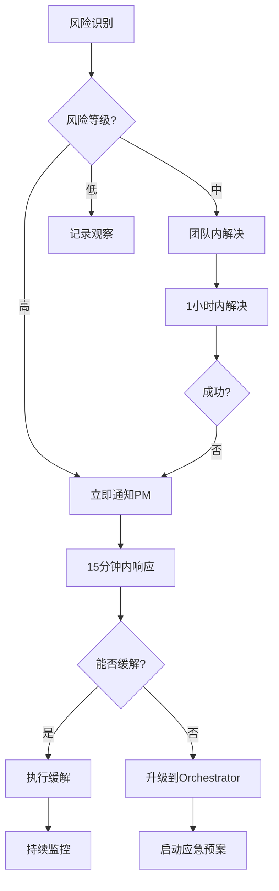

# 第二周风险监控与缓解方案
## Week 2 Risk Monitoring & Mitigation Plan

### 🎯 风险评估矩阵

| 风险等级 | 概率 | 影响 | 风险数量 | 重点关注 |
|----------|------|------|----------|----------|
| 🔴 高风险 | 高 | 高 | 2 | FFI内存泄漏、集成复杂度 |
| 🟡 中风险 | 中 | 高 | 2 | 事件循环性能、Demo失败 |
| 🟢 低风险 | 低 | 中 | 1 | 测试覆盖不足 |

---

## 🔴 高风险项目

### Risk-001: FFI内存泄漏
**风险描述**: Zig-C边界的内存管理错误导致泄漏  
**发生概率**: 70%  
**潜在影响**: 系统不稳定，无法通过验收  

#### 监控指标
```bash
# 实时内存监控脚本
#!/bin/bash
while true; do
  echo "=== FFI Memory Check $(date +%H:%M:%S) ==="
  
  # Valgrind检测
  valgrind --leak-check=full \
           --show-leak-kinds=all \
           ./test_ffi 2>&1 | grep -E "definitely lost|indirectly lost"
  
  # 内存使用趋势
  ps aux | grep ghostty | awk '{print $4 " " $5}'
  
  sleep 3600  # 每小时检查
done
```

#### 触发条件
- Valgrind报告任何"definitely lost"
- 内存使用持续增长>5%/小时
- 任何use-after-free错误

#### 缓解措施
1. **预防措施**
   - 每个FFI函数配对的alloc/free
   - 使用Zig的defer进行自动清理
   - 所有C指针标记ownership

2. **应急响应** (责任人: INTG-003)
   ```bash
   # 立即执行
   tmux send-keys -t ghostty-integration:5 "
   URGENT: 内存泄漏检测
   1. 停止当前开发
   2. 运行完整Valgrind套件
   3. 使用git bisect定位问题commit
   4. 30分钟内修复或回滚
   " Enter
   ```

3. **回滚方案**
   ```bash
   # 保存安全检查点
   git tag safe-$(date +%Y%m%d-%H%M) 
   git push --tags
   
   # 需要时回滚
   git checkout safe-[timestamp]
   ```

---

### Risk-002: 集成复杂度爆炸
**风险描述**: 组件接口不兼容导致集成失败  
**发生概率**: 60%  
**潜在影响**: Demo无法展示，项目延期  

#### 监控指标
- 接口变更次数>3次/天
- 集成测试失败率>30%
- 组件间通信错误

#### 早期预警信号
```bash
# 接口兼容性检查
#!/bin/bash
echo "=== Interface Compatibility Check ==="

# 检查头文件一致性
diff cache/week2/CORE-001/event_loop_backend.h \
     cache/week2/INTG-001/imported/event_loop_backend.h

# 检查ABI兼容性
nm -D libtmuxcore.so | grep -E "T |D " > current_abi.txt
diff previous_abi.txt current_abi.txt
```

#### 缓解措施
1. **增量集成策略**
   ```
   Phase 1: 单个函数测试 (周三)
   Phase 2: 模块级集成 (周四上午)
   Phase 3: 完整系统集成 (周四下午)
   Phase 4: Demo场景验证 (周五)
   ```

2. **接口冻结时间**
   - 周三17:00后: 核心接口冻结
   - 周四14:00后: 所有接口冻结
   - 仅允许bug修复

3. **快速验证脚本**
   ```bash
   # quick-integration-test.sh
   make clean && make
   ./test_event_loop && \
   ./test_grid_ops && \
   ./test_ffi_bridge && \
   echo "✅ Integration OK" || echo "❌ Integration FAILED"
   ```

---

## 🟡 中风险项目

### Risk-003: 事件循环性能退化
**风险描述**: Callback模式导致性能下降>1%  
**发生概率**: 40%  
**潜在影响**: 不满足性能要求  

#### 性能基准监控
```bash
#!/bin/bash
# performance-monitor.sh

# 基准测试
BASELINE=150000  # 150k ops/s

while true; do
  CURRENT=$(./benchmark | grep "ops/s" | awk '{print $2}')
  DEGRADATION=$(( (BASELINE - CURRENT) * 100 / BASELINE ))
  
  if [ $DEGRADATION -gt 1 ]; then
    echo "⚠️ Performance degradation: ${DEGRADATION}%"
    tmux send-keys -t ghostty-core:0 "ALERT: Performance degraded ${DEGRADATION}%" Enter
  fi
  
  sleep 300
done
```

#### 缓解措施
1. **保留原生路径** (责任人: CORE-001)
   ```c
   // 运行时切换
   if (performance_critical) {
       use_native_libevent();
   } else {
       use_callback_mode();
   }
   ```

2. **性能优化清单**
   - [ ] 内联关键函数
   - [ ] 减少间接调用
   - [ ] 缓存优化
   - [ ] SIMD where applicable

---

### Risk-004: Demo失败
**风险描述**: 周五14:00无法展示可工作的系统  
**发生概率**: 30%  
**潜在影响**: 项目信心受损  

#### Demo就绪检查清单
```bash
# demo-readiness.sh
#!/bin/bash

READY=true

# 检查所有组件
[[ -f cache/week2/INTG-001/ghostty/tmux_integration.zig ]] || READY=false
[[ -f cache/week2/CORE-001/event_loop_router.c ]] || READY=false
[[ -f cache/week2/CORE-002/grid_callbacks.c ]] || READY=false

# 检查集成测试
./integration_test || READY=false

# 检查性能
PERF=$(./benchmark | grep "ops/s" | awk '{print $2}')
[[ $PERF -gt 180000 ]] || READY=false

if $READY; then
  echo "✅ Demo Ready"
else
  echo "❌ Demo Not Ready - Activate Contingency"
fi
```

#### 应急方案
1. **录屏备份** (周四完成)
   ```bash
   # 录制成功场景
   asciinema rec demo-backup.cast
   # 执行所有demo步骤
   # Ctrl-D结束录制
   ```

2. **降级Demo**
   - Plan A: 完整tmux in Ghostty
   - Plan B: 基础功能演示
   - Plan C: 架构讲解+录屏

3. **Demo脚本**
   ```bash
   # demo-script.sh
   #!/bin/bash
   set -e  # 任何错误即停止
   
   echo "Step 1: Starting Ghostty..."
   ./ghostty --tmux-embedded &
   sleep 2
   
   echo "Step 2: Creating session..."
   tmux new-session -d -s demo
   
   echo "Step 3: Basic commands..."
   tmux send-keys -t demo "echo 'Hello from tmux in Ghostty!'" Enter
   
   echo "Demo completed!"
   ```

---

## 🟢 低风险项目

### Risk-005: 测试覆盖不足
**风险描述**: 无法达到75%覆盖率目标  
**发生概率**: 20%  
**潜在影响**: 质量信心不足  

#### 覆盖率追踪
```bash
# coverage-track.sh
#!/bin/bash

CURRENT=$(gcov *.c | grep "Lines executed" | awk '{print $2}' | sed 's/%//')
TARGET=75

echo "Current Coverage: ${CURRENT}%"
echo "Target: ${TARGET}%"
echo "Gap: $(( TARGET - CURRENT ))%"

if [ $CURRENT -lt $TARGET ]; then
  echo "⚠️ Below target - need more tests"
  
  # 识别未测试代码
  gcov -b *.c | grep "#####" | head -20
fi
```

#### 缓解措施
1. **并行测试开发**
   - 开发者写代码同时写测试
   - QA团队并行补充测试

2. **快速测试生成**
   ```bash
   # 为未测试函数生成测试模板
   grep "^[a-z].*(" *.c | while read func; do
     echo "void test_${func}() { /* TODO */ }"
   done > test_stubs.c
   ```

---

## 📊 风险监控Dashboard

### 实时监控脚本
```bash
#!/bin/bash
# risk-dashboard.sh

while true; do
  clear
  echo "======================================"
  echo "   风险监控面板 $(date +%Y-%m-%d\ %H:%M:%S)"
  echo "======================================"
  
  # 内存风险
  echo -e "\n🔴 内存状态:"
  ps aux | grep ghostty | awk '{printf "  Memory: %s%%\n", $4}'
  
  # 性能风险
  echo -e "\n🟡 性能指标:"
  echo "  Current: $(./benchmark 2>/dev/null | grep ops/s || echo 'N/A')"
  echo "  Target: 200k ops/s"
  
  # 集成风险
  echo -e "\n🟡 集成状态:"
  make test 2>&1 | grep -E "PASS|FAIL" | tail -5
  
  # 测试覆盖
  echo -e "\n🟢 测试覆盖:"
  echo "  Current: $(gcov *.c 2>/dev/null | grep Lines || echo 'N/A')"
  
  # 阻塞问题
  echo -e "\n⚠️ 当前阻塞:"
  for session in ghostty-core ghostty-integration ghostty-quality; do
    tmux capture-pane -t $session:0 -p | grep -i "blocked" | tail -1
  done
  
  sleep 60
done
```

### 风险升级流程



---

## 🚨 紧急联系方式

| 角色 | Session | 职责范围 | 升级时间 |
|------|---------|----------|----------|
| PM | tmux-orchestrator:0 | 所有风险 | 立即 |
| CORE-001 | ghostty-core:0 | 事件循环 | 15分钟 |
| INTG-001 | ghostty-integration:0 | FFI/集成 | 15分钟 |
| INTG-003 | ghostty-integration:5 | 性能/内存 | 立即 |
| QA-001 | ghostty-quality:0 | 质量问题 | 30分钟 |

---

## 📝 风险日志模板

```markdown
## Risk Log Entry
**Date**: 2025-08-XX HH:MM
**Risk ID**: RISK-XXX
**Severity**: High/Medium/Low
**Status**: Active/Mitigated/Closed

### Description
[问题描述]

### Impact
[潜在影响]

### Mitigation Applied
[采取的措施]

### Result
[结果]

### Follow-up
[后续行动]

**Logged by**: [Name]
```

---

**文档版本**: v1.0  
**创建时间**: 2025-08-25  
**负责人**: tmux-project-manager  
**下次评审**: 2025-08-28 (周三)